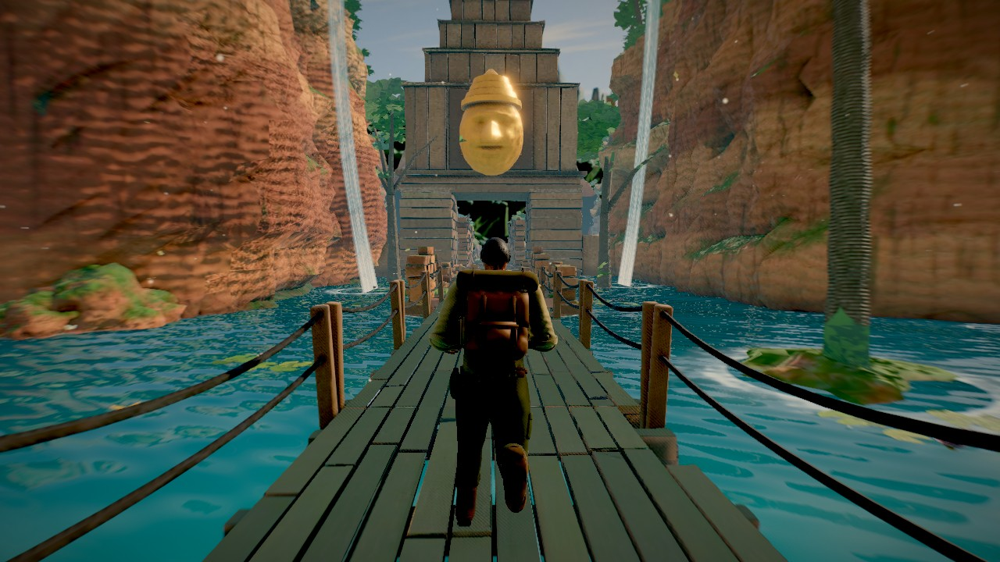
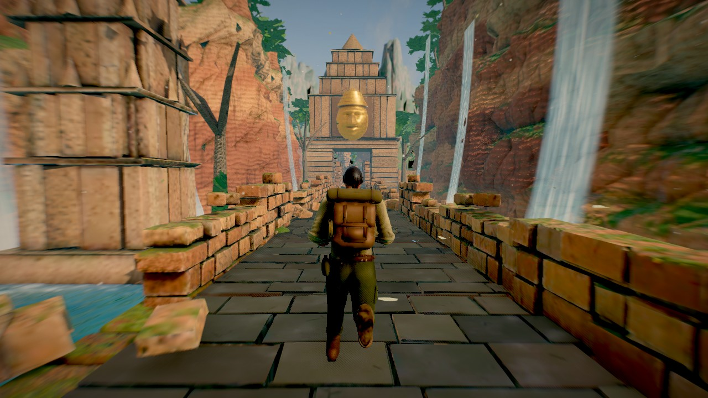
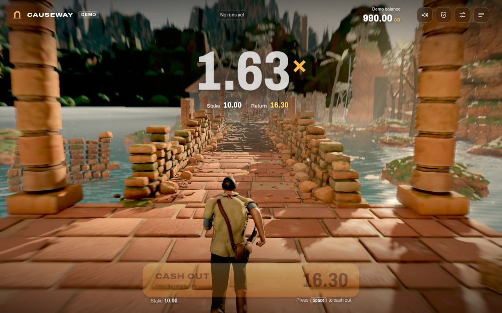
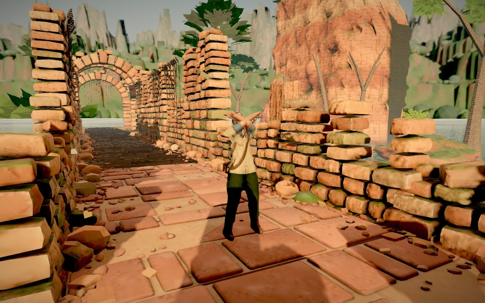
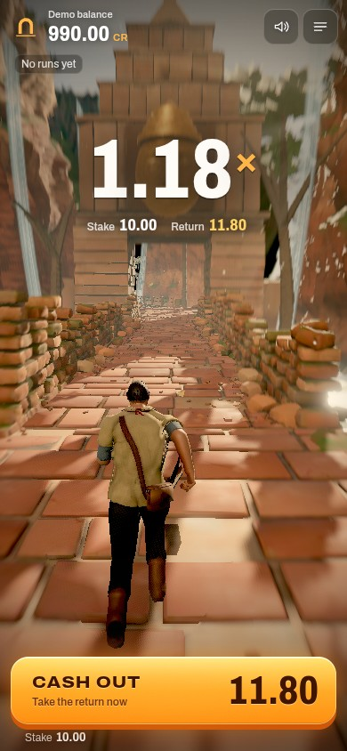
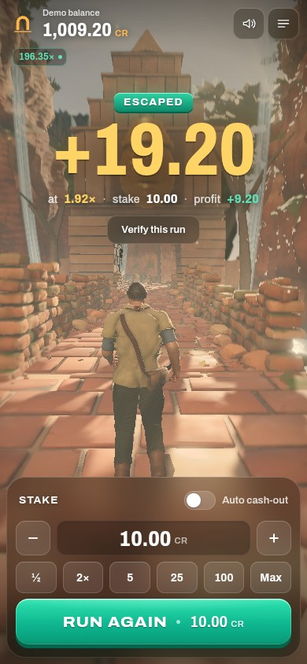

# CAUSEWAY

<p align="center">
  
  
</p>
<p align="center">
  
  
</p>
<p align="center">
  
  
</p>

**A crash game told as an escape run.** A runner sprints down a sunken causeway
through collapsing jungle ruins. The multiplier climbs with every stride, the
ruins shake harder, the camera and the score push faster. Cash out whenever you
like for stake × multiplier. If the way falls first — a gate slams down, the
slabs drop into the water, the cliff comes down — the stake is lost.

The mechanic is a standard crash game: the fall point is fixed before the run
starts, returns 97% whatever the cash-out point, and is verifiable afterwards.
The runner, the route and the tremors are presentation. They carry no
information about where the round ends, and nothing the player does on the
path can change it.

```bash
npm install
npm run dev            # http://localhost:5180
```

Useful URL parameters: `?q=low|medium|high|ultra` forces a graphics tier;
`?seed=<text>` runs a reproducible QA session (fixed server-seed stream);
`?qa` exposes `__game`, `__ctl` and `__store` in a production build.

> **Free play prototype.** Demo credits only. The round authority in this build
> runs in a Web Worker inside the browser; it is clearly separated as a demo
> adapter and is not a production backend. See *Going to production* below.

---

## A round

| | |
| --- | --- |
| **Stake** | Choose a stake (0.10–1,000.00), optionally an auto cash-out (≥ 1.01×). |
| **Run** | The bet is debited and the runner coils for 1.1 s at 1.00×, then sets off. |
| **Rise** | `m(t) = e^(0.000063·t)` — 2× at ~11 s, 10× at ~37 s, 100× at ~73 s. Speed, camera lens, blur, score tempo and tremors all scale with `ln m`. |
| **Cash out** | Tap/click the dock button or press **Space**. Paid `floor(stake × m)` at the server's clock. |
| **Or the way falls** | At the crash point the world stages a collapse around the runner; the stake is lost. |
| **Verify** | The server seed is revealed; recompute the fall point in the *Provably fair* panel. |

## Fairness and the math

```
commitment = SHA-256(serverSeed)                 shown before the bet
h          = first 52 bits of HMAC-SHA-256(serverSeed, "clientSeed:nonce")
crash      = floor(100 · 0.97 · 2^52 / (2^52 − h)) hundredths, clamped to [1.00×, 10,000×]
```

So `P(crash ≥ m) = 0.97 / m` exactly (to 2⁻⁵²), and cashing out at any target
`m` returns 97% on average. About 3.96% of runs fall at 1.00×. A run that
reaches 10,000× pays every live stake at 10,000× (so "never cash out" also
returns 97%). All money is integer hundredths of a credit and all crash math is
`BigInt`; `tests/crash-math.test.ts` checks the closed form at the boundary
draws, not just by simulation.

Ties go to the player: cashing out at exactly the crash multiplier wins. A
cash-out that arrives after the crash time is settled as the crash, even if the
crash timer has not fired yet.

## Architecture

```
src/engine/     pure, dependency-free round math: curve, crash derivation, money, cosmetic RNG
src/service/    the only door to money
  protocol.ts         wire messages (the same ones a WebSocket RGS adapter would speak)
  RoundService.ts     the interface the game depends on
  demoServer.ts       DEMO authority: seeds, balance, clock, timers — clock-injected, testable
  demo.worker.ts      hosts it in a Web Worker so the UI and renderer never hold a live seed
  WorkerRoundService  client side of that transport (clock sync, request/reply, pushes)
src/state/      zustand store + Controller: service ⇄ world ⇄ UI ⇄ audio; never waits on animation
src/render/     Game (loop, staging), CameraRig, post stack (zoom blur, bloom, AgX, grade), particles
src/world/      assets, path (lines + arcs by arc length), section library, track manager,
                instanced walkable tiles (they can give way), water, waterfall, debris, runner
src/audio/      procedural WebAudio: ambience beds, footsteps, impacts, adaptive score, stingers
src/ui/         React interface: title, top bar + history, HUD, dock (stake / cash out), panels
blender/        headless Blender (bpy 4.2) generators for every 3D asset in public/assets
```

* **The crash point never reaches the main thread before settlement.** The UI
  and renderer see a `LiveRound` (id, commitment, stake, start time); the seed
  and crash point arrive only in the settled round.
* **The multiplier on screen is the server's.** The client animates
  `multiplierAt(serverNow − runStartsAt)` with a clock offset estimated from
  request round-trips, and a cash-out is priced by the authority at receipt.
* **React never renders per frame.** The multiplier and the cash-out amount are
  written to the DOM from `requestAnimationFrame`; the 3D loop is plain
  three.js outside React.
* **Crash staging** picks one of three events that suit the section the runner
  is in (a falling slab gate, the slabs ahead dropping into the water, a
  rockfall), using a cosmetic RNG seeded from the *settled* round id — after the
  outcome is public, never before.
* **Danger cues** (tremors, grit falling off walls, the score's tempo, the warm
  grade) are functions of the current multiplier only.

### The Blender pipeline

Every mesh, texture and animation in `public/assets` is generated by the scripts
in `blender/` with headless Blender (`pip install bpy==4.2.0 "numpy<2"`):

| Script | Makes |
| --- | --- |
| `build_kit.py` | The ruin kit: dry-stone walls, slab floors, stairs, pillars, arches, towers, a carved gate, rubble, rocks, plank bridges; palms, jungle trees, bushes, vines and grass as cards. Procedural materials (sandstone, terracotta, rock, wood, bark) are baked with Cycles into colour / normal / ORM atlases with AO; leaves are modelled and rendered into an alpha atlas. → `kit.glb` |
| `build_runner.py` | The runner: the owner-supplied character in `blender/sources/runner/` (see its `PROVENANCE.md`; rigged locally, never sent to an external service), kept exactly as supplied — cream henley, denim, leather harness — and fitted and weighted to our skeleton by `char_source.py`, `char_rig.py` and `char_paint.py`. All 19 clips come from `runner_anim.py`: gaits solved by stance IK against the moving floor (`qa_gait_audit.py` checks planted-foot drift, contact, flight and knee drive per clip), plus idles, falls and escapes. `--procedural` builds the earlier fully procedural character (`build_runner_procedural.py`). → `runner.glb` |
| `build_backdrop.py` | The far world as an equirectangular Cycles render: Nishita sky, terraced cliffs, karst towers, jungle, distant temples and open water, plus an HDR for image-based lighting and the measured sun direction. → `backdrop.webp`, `env.hdr`, `backdrop.json` |

`python3 blender/build_kit.py --fast` bakes at quarter resolution for look-dev.

### Asset delivery (after every re-export)

Blender's exports (`kit.glb`, `runner.glb`, `env.hdr`) are pipeline **inputs**:
the game never downloads them and `vite build` leaves them out of `dist`. After
re-exporting anything, run:

```sh
npm run assets:optimize        # ~1 min; unchanged inputs are skipped (--force rebuilds)
```

It writes, into `public/assets/`:

| File | What |
| --- | --- |
| `kit.high.glb`, `runner.high.glb` | meshopt geometry (`EXT_meshopt_compression` + `KHR_mesh_quantization`), WebP textures ≤ 2048 px (roughness atlases 1024 px, stored grey) |
| `kit.mobile.glb`, `runner.mobile.glb` | the same, textures ≤ 1024 px (roughness and the small wood/bark/flora atlases 512 px), solid pieces simplified by ≤ 0.2 % of their size |
| `env.half.hdr` | the IBL map at 512×256 (it only lights rough surfaces through PMREM) |
| `manifest.json` | per file: bytes and content hash; bundled into the JS, so every asset URL carries `?v=<hash>` and `/assets/*` is served immutable (`public/_headers`) |

Commit the outputs with the inputs. The loader picks **mobile** for phones, the
Low tier, Save-Data and ≤ 4 GB devices, **high** otherwise; `?assets=high|mobile`
overrides. Runner animation channels that hold a bone at rest in every clip are
dropped; if a new clip moves such a bone, it is kept automatically.

| First load (assets) | Before | high | mobile |
| --- | --- | --- | --- |
| bytes | 26.2 MB | 9.0 MiB | 4.6 MiB |

`npm run bench -- --q low --net 4g` (with a server on `URL`, default
`http://localhost:5195`) measures load bytes/time, the loading bar, ms/frame, draw
calls, triangles, JS allocation per frame and memory over 10 rounds in headless
Chromium; compare builds by relative numbers (SwiftShader is slow).

### Section library

`start`, `corridor`, `bridge` (plank, rope-railed and waterfall-gorge styles),
`arcade`, `gate`, `tall`, `plaza` (turning), `stairsDown`, `stairsUp`, `cliff`
(with waterfall), `ruins`, `avenue` (colossal guardians standing in the water) and
`gorge` (cliff walls with waterfalls, ending at a golden face gate or an idol), `boardwalk`
(weathered planks over water, boulders and a mossy bank), `tunnel` (a vine-hung
vaulted passage with light at the exit; rockfall and chasm only) and `statues`
(guardians on plinths, a lintel gate and ruined facades at the vanishing point).
Each has several seeded variants merged per material at load (a few draw calls
each), mirrored at random, dressed with ferns, moss, roots, relief walls, fallen
colossi and lily pads, with islands, palms, towers and cliffs out over the water.
Pacing rules keep elevation within one flight of stairs and avoid repeats.

### Presentation by multiplier

Everything below depends only on the **current** multiplier while running, or on
the **settled** multiplier and round id afterwards — never on the hidden fall point.

| Tier | Multiplier | Run | Score | HUD |
| --- | --- | --- | --- | --- |
| 0 | < 2× | composed run | kick + arpeggio | bone |
| 1 | 2–5× | run → sprint | + bass, shaker | warming |
| 2 | 5–10× | sprint, glances back | + strings, taiko | gold |
| 3 | 10–25× | sprint → dash | + octave bass | hot gold |
| 4 | 25×+ | desperate dash | chord change every bar | full heat |

Milestones flare at 2, 5, 10, 25, 50 and 100×. A fall stages one of two variants
per hazard (chasm, gate, rockfall), a cash-out one of four escapes (look back,
cheer, salute, leap); both scale their slow motion, camera and effects with the
settled multiplier. An escape never shows or sounds how close the fall was.

## Quality and performance

Four tiers (pixel-ratio cap, shadow map size, bloom, SMAA, foliage and scenery
density, view distance, particle budget, water detail). The first guess comes
from the device; a frame-time governor steps down automatically (switchable in
Settings). Walkable tiles are instanced; props are merged per material per
section variant; all programs are pre-compiled during loading.

## Tests

```bash
npm test          # vitest: math, fairness, demo authority, controller, route soak
npm run build     # typecheck + production bundle
npm run e2e       # (requires Chromium) headless screenshots, see tools/shoot.mjs
```

## Going to production

What exists: the protocol, a demo authority that implements it, and a client
that depends only on `RoundService`. What a real deployment needs and this
repository does not have:

* the authority behind a network boundary (WebSocket), with durable storage,
  a server-seed hash chain published in advance, and operator wallet/RGS
  integration (debit on bet, credit on settlement, idempotency, reconciliation);
* recorded audio and final art where the procedural placeholders stand in;
* responsible-gambling features required by the target jurisdiction, and
  certification. No certification is claimed.
